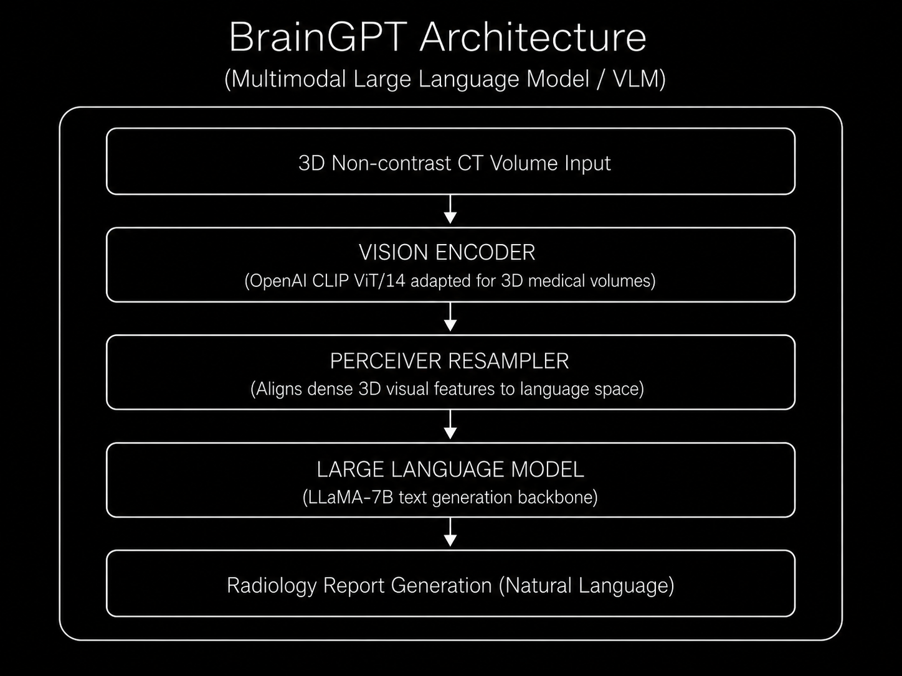

# Model Card: BrainGPT

> **Clinically Visual Instruction-Tuned MLLM for 3D Brain CT Radiology Report Generation**

---

## Model Overview

| Property | Details |
|----------|---------|
| **Model Name** | BrainGPT |
| **Version** | v1.0 |
| **Model Type** | Multimodal Large Language Model (MLLM) |
| **Architecture** | Otter/OpenFlamingo framework (CLIP ViT/14 + Perceiver + LLaMA-7B) |
| **Parameters** | **~7 Billion** (dominated by LLaMA-7B) |
| **Input Modality** | 3D Non-contrast Head/Brain CT Volumes |
| **Developer** | Academic Researchers |
| **Publication** | Various recent preprints (2024-2025) |
| **License** | Research Use Only |
| **Repository** | N/A (Internal/Academic release) |

---

## Intended Use

### Primary Use Cases
- **3D Brain CT Radiology Report Generation** (Image-to-Text)
- **Automated diagnosis** of brain abnormalities (hemorrhages, lesions)
- **Clinical reasoning** modeling for neuroradiology workflows

### Target Users
- Neuroradiologists and clinical AI researchers
- Hospitals looking to automate initial CT report drafting
- Medical AI engineers developing diagnostic assistants

### Out-of-Scope Uses
- Sole diagnostic decision-making without human oversight
- 2D image analysis (optimized explicitly for 3D volumes)
- Modalities other than non-contrast Head/Brain CT

---

## Architecture

### High-Level Design



### Architectural Refinements over Standard VLMs

| Component | Standard VLM (e.g., LLaVA) | BrainGPT |
|-----------|---------------------------|----------|
| **Vision Input** | 2D Image slices | Native 3D Volumetric CT |
| **Vision Encoder** | 2D CLIP ViT | 3D-adapted CLIP ViT/14 |
| **Training Paradigm**| Standard Instruction Tuning | Clinical Visual Instruction Tuning (CVIT) |
| **Frozen Modules** | Only LLM frozen | Most blocks frozen to maintain efficiency |

---

## Training Details

### Pre-training / Fine-tuning

| Property | Details |
|----------|---------|
| **Dataset** | 3D-BrainCT |
| **Volume Count** | ~18,885 paired 3D CT scans |
| **Annotations** | Paired diagnostic text reports |
| **Training Type** | Clinical Visual Instruction Tuning (CVIT) |
| **Hardware** | Multi-GPU clusters (A100 equivalent) |

### Training Protocol
1. Initialize with Otter/OpenFlamingo base weights.
2. Adapt the vision encoder for 3D medical volumes.
3. Freeze the majority of model blocks (except input/output embeddings and cross-attention).
4. Fine-tune using Clinical Visual Instruction Tuning (CVIT) on the 3D-BrainCT dataset.

---

## Benchmark Performance

### Standard Natural Language Generation (NLG) Metrics

| Metric | Score |
|--------|-------|
| **BLEU-1** | 44.35 |
| **BLEU-4** | 20.38 |
| **METEOR** | 30.13 |
| **ROUGE-L**| 47.60 |
| **CIDEr-R**| 211.77|

### Clinical Diagnostic Metrics (FORTE Framework)

| Diagnostic Component | F1-Score | Description |
|----------------------|----------|-------------|
| **Degree** | 0.661 | Captures severity and quantity of findings |
| **Landmark** | 0.706 | Accuracy of anatomical locations |
| **Feature** | 0.693 | Visual characteristics of abnormalities |
| **Impression** | 0.779 | Overall diagnostic conclusion |
| **Overall Average** | **0.710**| **Average FORTE F1-score** |

*In blinded Turing-test evaluations, approximately **74%** of reports generated by BrainGPT were deemed indistinguishable from those written by human expert radiologists.*

---

## Key Innovations

1. **Native 3D Processing:** Addresses the "3D processing gap" by ingesting volumetric CTs directly, avoiding information loss from 2D slicing.
2. **FORTE Evaluation:** Pioneers the use of clinically relevant metrics over standard NLP scores to gauge diagnostic accuracy.
3. **Clinical Visual Instruction Tuning (CVIT):** Bridges the gap between raw volumetric data and nuanced clinical text generation.
4. **Pathological Focus:** Designed to filter out massive amounts of irrelevant anatomical area to focus strictly on small, critical pathological findings.
5. **Workflow Emulation:** Mimics a radiologist's diagnostic workflow by decomposing the reading process into fine-grained observations.

---

## Limitations

- **Compute Intensive:** Requires significant GPU resources for 3D processing coupled with a 7B LLM.
- **Modality Specific:** Highly specialized for non-contrast brain CTs; does not easily transfer to MRI or contrasting modalities without complete retraining.
- **Hallucination Risks:** Like all LLMs, is susceptible to hallucinating clinical findings if the visual grounding fails.
- **Metric Limitations:** Even with FORTE, fully capturing the nuanced reasoning of a human radiologist remains challenging.

---

## Ethical Considerations

- **Clinical Validation Required:** Must undergo rigorous site-specific validation before clinical deployment.
- **Automation Bias:** Radiologists may overly rely on the generated text, potentially missing subtleties not captured by the model.
- **Patient Privacy:** Models must be strictly trained on de-identified data to prevent PHI leakage.
- **Regulatory Compliance:** No FDA/CE clearance — strictly for research use.

---

## Citation

```bibtex
@article{braingpt2024,
  title={BrainGPT: Multimodal Large Language Models for 3D Brain CT Radiology Report Generation},
  author={BrainGPT Research Group},
  journal={arXiv preprint},
  year={2024}
}
```

---


