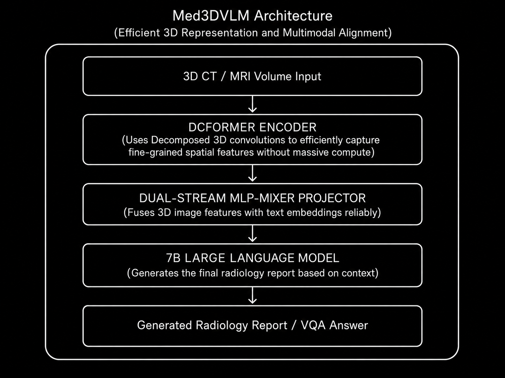

# Model Card: Med3DVLM

> **An Efficient Vision-Language Model for 3D Medical Image Analysis**

---

## Model Overview

| Property | Details |
|----------|---------|
| **Model Name** | Med3DVLM |
| **Version** | v1.0 |
| **Model Type** | 3D Vision-Language Foundation Model |
| **Architecture** | DCFormer encoder + Dual-stream MLP-Mixer projector + LLM |
| **Parameters** | **~7 Billion** |
| **Input Modality** | 3D Medical Volumes (General CT/MRI scans) |
| **Developer** | University of Florida (Yu Xin, Gorkem Can Ates, et al.) |
| **Publication** | arXiv (2024) |
| **License** | Open Source / Academic Research |
| **Repository** | [GitHub](https://github.com/xin-yu-uf/Med3DVLM) |

---

## Intended Use

### Primary Use Cases
- **3D Radiology Report Generation** (Image-to-Text) spanning multiple organ systems.
- **Medical Visual Question Answering (VQA)** for 3D volumetric images.
- **Efficient 3D Feature Extraction** using decomposed convolution techniques.

### Target Users
- AI engineers building clinical foundation models for pan-organ volumetric data.
- Medical imaging researchers requiring computationally efficient 3D encoders.
- Hospitals seeking to automate initial diagnostic drafts for diverse CT/MRI scans.

### Out-of-Scope Uses
- Real-time intraoperative surgical guidance.
- 2D image analysis (e.g., standard Chest X-rays) without volumetric depth.
- Autonomous medical decision-making without human oversight.

---

## Architecture

### High-Level Design



### Architectural Refinements over Standard 3D VLMs

| Component | Standard Approach | Med3DVLM Approach |
|-----------|-------------------|-------------------|
| **3D Convolutions** | Standard dense 3D CNNs (High memory) | DCFormer (Decomposed 3D convolutions) |
| **Multimodal Fusion** | Simple linear projection | Dual-stream MLP-Mixer projector |
| **Scale** | Often requires >13B parameters | Optimized at ~7B parameters |

---

## Training Details

### Pre-training

| Property | Details |
|----------|---------|
| **Dataset** | Mixed diverse 3D datasets (e.g., M3D dataset cohorts) |
| **Annotations** | Paired 3D scans and textual reports/Q&A |
| **Training Type** | Multimodal instruction tuning |
| **Hardware** | Standard multi-GPU academic clusters |

### Training Protocol
1. Pre-train the DCFormer encoder to establish robust decomposed 3D spatial representations.
2. Freeze the 7B LLM backbone to preserve linguistic capabilities and prevent catastrophic forgetting.
3. Train the dual-stream MLP-Mixer projector to align the visual and textual embedding spaces efficiently.

---

## Benchmark Performance

### Report Generation & VQA Metrics

Med3DVLM focuses heavily on efficient multimodal alignment, performing strongly against much heavier architectures on standard multi-organ 3D benchmarks.

| Metric | Context / Comparison |
|--------|----------------------|
| **METEOR Score** | Significant improvements in report generation over standard baseline 3D VLMs. |
| **VQA Accuracy** | Demonstrates superior accuracy in spatial localization questions across the 3D volume. |
| **Compute Cost** | Substantially lower FLOPS and memory usage during both training and inference compared to dense 3D ViT encoders. |

---

## Key Innovations

1. **DCFormer Integration:** Solves the notorious computational bottleneck of processing dense 3D volumes by decomposing 3D convolutions, making it highly memory-efficient.
2. **Dual-Stream Projection:** The MLP-Mixer ensures that the rich spatial context captured by the DCFormer is not lost when projecting into the 1D text embedding space.
3. **Pan-Organ Focus:** Designed to generalize across medical modalities and anatomies rather than being strictly limited to head or chest imaging.
4. **Accessible Compute Scale:** Operating at a ~7B parameter scale makes it highly deployable for academic and clinical research teams without massive cloud infrastructure.

---

## Limitations

- **Generalization Limits:** While pan-organ, rare pathologies outside the training distribution can lead to degraded report generation.
- **Frozen LLM Trade-offs:** Keeping the 7B LLM entirely frozen improves efficiency but can occasionally limit deep stylistic adaptation to highly specialized clinical formatting.
- **Still Compute Heavy for Edge:** Despite being efficient for 3D, processing volumetric data at 7B scale still prohibits deployment on standard workstation GPUs (e.g., requires >24GB VRAM).

---

## Ethical Considerations

- **Clinical Validation Required:** Must undergo rigorous site-specific validation before clinical deployment.
- **Risk of Hallucination:** Even with strong alignment, the model may confidently hallucinate anatomical abnormalities.
- **Regulatory Compliance:** No FDA/CE clearance — strictly for research use.

---

## Citation

```bibtex
@article{xin2024med3dvlm,
  title={Med3DVLM: An Efficient Vision-Language Model for 3D Medical Image Analysis},
  author={Xin, Yu and Ates, Gorkem Can and Gong, Kuang and Shao, Wei},
  journal={arXiv preprint},
  year={2024}
}
```

---


