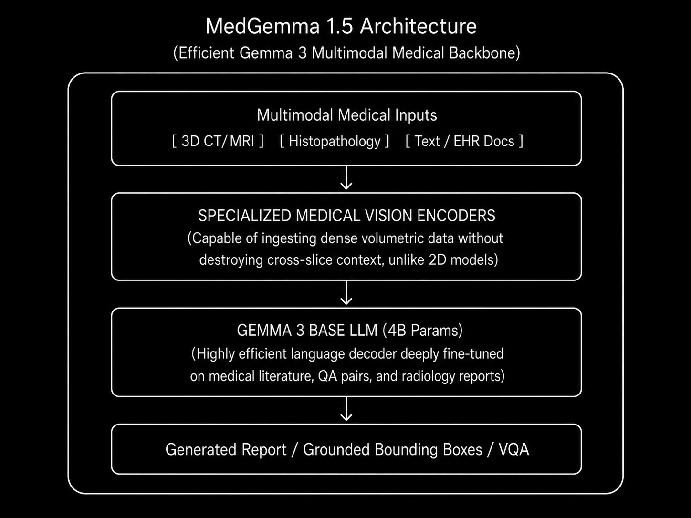

# Model Card: MedGemma 1.5

> **Open-Source Multimodal Medical AI Model for 3D and High-Dimensional Imaging**

---

## Model Overview

| Property | Details |
|----------|---------|
| **Model Name** | MedGemma 1.5 |
| **Version** | v1.5 |
| **Model Type** | Multimodal Medical Foundation Model |
| **Architecture** | Built on Gemma 3 architecture with specialized medical modality encoders |
| **Parameters** | **4B** (Compute-efficient multimodal variant) |
| **Input Modality** | 3D CT/MRI Volumes, Whole-Slide Histopathology (WSI), Longitudinal X-rays, EHR |
| **Developer** | Google |
| **Publication** | 2025 |
| **License** | Open Weights / Research & Developer Use |
| **Repository** | [Hugging Face / Google Cloud Vertex AI](https://huggingface.co/google) |

---

## Intended Use

### Primary Use Cases
- **3D Radiology Report Generation:** Native interpretation of 3D CT and MRI volumetric representations.
- **Multimodal Clinical Q&A:** Providing data-driven responses to complex clinical queries based on both images and unstructured electronic health records (EHR).
- **Anatomical Localization:** Using bounding boxes to locate specific pathologies within the 3D volume.
- **Longitudinal Analysis:** Comparing current chest scans against historical data over time.

### Target Users
- Healthcare developers building privacy-preserving, local clinical workflows.
- AI researchers requiring a robust, compute-efficient foundation model for medical imaging.
- Medical institutions exploring generative AI on Google Cloud (Vertex AI).

### Out-of-Scope Uses
- Sole basis for clinical decision making (Not a clinical-grade medical device).
- Autonomous diagnosis without physician oversight.

---

## Architecture

### High-Level Design

### Architectural Refinements over Standard VLMs

| Component | Standard Medical VLM | MedGemma 1.5 |
|-----------|----------------------|--------------|
| **Dimensionality** | Restricted to 2D slices | Native 3D volumetric analysis |
| **Model Scale** | Requires massive scale (>13B) | Highly optimized at **4 Billion** parameters |
| **Deployment** | Cloud-dependent | Can run locally for privacy-preserving workflows |

---

## Training Details

### Pre-training & Fine-Tuning

| Property | Details |
|----------|---------|
| **Foundation** | Google's Gemma 3 architecture |
| **Datasets** | Massive proprietary and open medical datasets spanning radiology, pathology, and EHR |
| **Hardware** | Google TPU v5 pods |

### Performance Improvements over v1.0
- **3D MRI Condition Classification:** +11% absolute improvement.
- **3D CT Condition Classification:** +3% absolute improvement.
- Vastly enhanced capabilities in handling complex, high-resolution Whole-Slide Imaging (WSI).

---

## Benchmark Performance

### Clinical Utility Benchmarks

MedGemma 1.5 focuses heavily on multimodal accuracy and computational efficiency, proving that smaller models can compete with massive proprietary equivalents when trained effectively.

| Metric Domain | Performance Context |
|---------------|---------------------|
| **3D Image Interpretation** | Strong gains in identifying and classifying conditions in native 3D CT/MRI spaces compared to slice-by-slice processing. |
| **Local Deployability** | Operates comfortably in resource-constrained environments (e.g., local hospital servers) due to its 4B parameter footprint. |
| **Document Understanding** | High accuracy in extracting structured clinical variables from unstructured medical text and PDFs. |

---

## Key Innovations

1. **Native 3D Processing at 4B Scale:** Shatters the assumption that processing massive 3D CT/MRI tensors requires models exceeding 10B parameters.
2. **True Multimodality:** Doesn't just do radiology—it handles whole-slide histopathology and complex longitudinal tracking.
3. **Open-Weight Ecosystem:** By releasing it in Model Garden and Hugging Face, Google democratized access to enterprise-grade 3D medical AI.
4. **Anatomical Grounding:** Capable of explicitly localizing findings via bounding boxes rather than just generating abstract text.

---

## Limitations

- **Diagnostic Authority:** It is a foundational developer tool, not an FDA-cleared diagnostic device.
- **Complex Reasoning Limitations:** At 4B parameters, it may occasionally struggle with the deep, multi-paragraph deductive reasoning seen in 70B+ models or human experts.
- **Modality Specifics:** While supporting 3D, extremely high-resolution native volumes may still require preprocessing or downsampling to fit context windows.

---

## Ethical Considerations

- **Human-in-the-Loop:** Safety guidelines strictly mandate human expert review for all AI-generated outputs.
- **Algorithmic Bias:** Users must validate the model on local demographics to ensure it doesn't propagate biases present in its pre-training data.
- **Data Privacy:** Because it can run locally, it represents a significant step forward for patient data privacy compared to API-only models.

---

*Model card prepared for internal research reference — Brain Foundation Models Lab*
