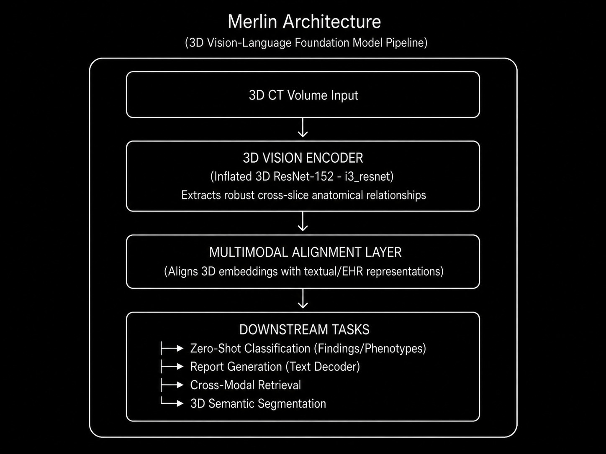

# Model Card: Merlin

> **3D Vision-Language Foundation Model for Computed Tomography Interpretation**

---

## Model Overview

| Property | Details |
|----------|---------|
| **Model Name** | Merlin |
| **Version** | v1.0 |
| **Model Type** | 3D Vision-Language Foundation Model |
| **Architecture** | 3D ResNet-152 vision encoder + multimodal alignment |
| **Parameters** | **~100M - 200M** (Efficient 3D ResNet-152 vision backbone) |
| **Input Modality** | 3D CT Volumes (Head, Abdomen, Chest) |
| **Developer** | Stanford AIMI (StanfordMIMI / Langlotz Lab) |
| **Publication** | Nature 2026 |
| **License** | Open Source |
| **Repository** | [GitHub](https://github.com/StanfordMIMI/Merlin) / [Hugging Face](https://huggingface.co/stanfordmimi/Merlin) |

---

## Intended Use

### Primary Use Cases
- **Radiology Report Generation** (Image-to-Text) directly from 3D CT.
- **Zero-shot Findings Classification** (identifying pathologies without task-specific tuning).
- **3D Semantic Segmentation** (up to 20 organs via nnU-Net integration).
- **Cross-Modal Retrieval** (Text-to-Image / Image-to-Text).
- **Chronic Disease Prediction** (5-year risk forecasting).

### Target Users
- Radiology researchers and medical AI developers.
- Clinical teams seeking foundation models for downstream fine-tuning.
- Institutions looking to deploy automated triaging or reporting tools.

### Out-of-Scope Uses
- Unsupervised autonomous diagnostic decisions.
- Real-time intraoperative processing.
- Modalities outside of Computed Tomography (e.g., Ultrasound).

---

## Architecture

### High-Level Design



### Architectural Refinements over 2D VLMs

| Component | 2D VLM approach | Merlin (3D) approach |
|-----------|-----------------|----------------------|
| **Volume Handling** | Slices treated independently | True 3D convolutions (i3_resnet) |
| **Context Retention** | Loses Z-axis anatomical context | Preserves full spatial relationships |
| **Supervision** | Manual expert bounding boxes/masks | Annotation-free (EHR & report text) |
| **Compute Footprint** | Massive for full volume processing | Optimized (Trainable on single A6000) |

---

## Training Details

### Pre-training

| Property | Details |
|----------|---------|
| **Dataset Source** | Stanford University School of Medicine |
| **CT Volumes** | ~15,331 distinct scans (>6 million CT images) |
| **Textual Data** | 1.8+ million EHR diagnosis codes, 6+ million report tokens |
| **Supervision Type** | Annotation-free, multimodal contrastive learning |
| **Hardware** | Single NVIDIA A6000 GPU (highly optimized) |

### Transfer Learning / Task Protocol
1. Load pre-trained Merlin 3D vision backbone.
2. For generation: Attach language decoder and fine-tune on specific report style.
3. For segmentation: Integrate backbone directly into nnU-Net pipeline.
4. For classification: Perform zero-shot inference using aligned text embeddings.

---

## Benchmark Performance

### Broad Evaluation Scope

Merlin was rigorously evaluated across **752 individual tasks** spanning 6 clinical categories.

| Task Category | Scope | Performance Context |
|---------------|-------|---------------------|
| **Findings Classification (Zero-Shot)** | 31 classes | Outperforms 2D-adapted baselines |
| **Phenotype Classification** | 692 phenotypes | High precision on patient conditions |
| **Cross-Modal Retrieval** | Text-to-Image | Superior multimodal alignment |
| **Report Generation** | Image-to-Text | Highly accurate anatomical localization |
| **Semantic Segmentation** | 20 organs | State-of-the-art dense mask prediction |
| **Chronic Disease Prediction**| 6 diseases | Effective 5-year risk forecasting |

### Highlighted Metrics

| Metric | Context / Baseline Comparison | Score |
|--------|-------------------------------|-------|
| **AUROC (Zero-Shot)** | vs. 2D CLIP-adapted models | Up to **81.2%** on key 3D-native benchmarks |
| **Report Grounding** | Anatomical localization accuracy | **Superior** to traditional VLM baselines |

---

## Key Innovations

1. **Annotation-Free Supervision:** Bypasses the massive bottleneck of manual pixel-level annotations by utilizing existing EHR codes and text reports.
2. **True 3D Architecture:** Uses an Inflated 3D ResNet-152 to process native volumes, avoiding the pitfalls of 2.5D slice stacking.
3. **Massive Multitasking:** Capable of performing 752 distinct downstream tasks from a single unified representation space.
4. **Extreme Compute Efficiency:** Despite operating on massive 3D volumes, the architecture is efficient enough to be trained on a single A6000 GPU.
5. **Open Source Release:** Completely open-weights model, democratizing 3D foundation model research in medical imaging.

---

## Limitations

- **Dataset Bias:** Pre-trained heavily on Stanford Medicine data; may require fine-tuning for drastically different scanner protocols.
- **EHR Noise:** Relies on potentially noisy EHR diagnosis codes for supervision.
- **Hardware Needs:** While trainable on an A6000, 3D inference still requires more memory than standard 2D models.
- **Complex Integration:** Leveraging the full suite of 752 tasks requires a deep understanding of its multimodal embedding space.

---

## Ethical Considerations

- **Clinical Validation Required:** Must undergo site-specific validation before clinical deployment.
- **Demographic Bias:** Stanford patient population may not represent global or rural clinical demographics.
- **Regulatory Compliance:** No FDA/CE clearance — strictly for research use.

---

## Citation

```bibtex
@article{merlin2026,
  title={Merlin: A Computed Tomography Vision-Language Foundation Model and Dataset},
  author={Stanford AIMI (StanfordMIMI)},
  journal={Nature},
  year={2026},
  doi={10.1038/s41586-026-10181-8}
}
```

---


