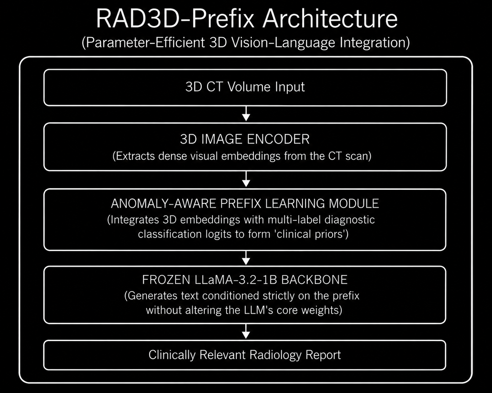

# Model Card: RAD3D-Prefix

> **Parameter-Efficient Framework for 3D Volumetric Medical Report Generation**

---

## Model Overview

| Property | Details |
|----------|---------|
| **Model Name** | RAD3D-Prefix |
| **Version** | v1.0 |
| **Model Type** | Parameter-Efficient 3D Vision-Language Model |
| **Architecture** | 3D Encoder + Anomaly-Aware Prefix Module + Frozen LLM |
| **Parameters** | **~1 Billion** (Utilizes LLaMA-3.2-1B backbone) |
| **Input Modality** | 3D CT Volumes (Pan-organ applications) |
| **Developer** | Academic Researchers (International) |
| **Publication** | arXiv / OpenReview (2024/2025) |
| **License** | Open Source / Academic Research |
| **Repository** | N/A (Academic codebase) |

---

## Intended Use

### Primary Use Cases
- **Parameter-Efficient Report Generation** directly from 3D volumetric CT scans.
- **Out-of-Domain Generalization** for medical imaging scenarios where large-scale full fine-tuning is computationally impossible.
- **Clinical Hallucination Mitigation** by injecting strong, anomaly-aware clinical priors.

### Target Users
- Researchers requiring highly efficient foundation models (e.g., runnable on consumer-grade hardware).
- Healthcare institutions that want to adapt generative AI to proprietary local data without full LLM retraining.

### Out-of-Scope Uses
- Unsupervised, fully autonomous diagnostic triage.
- Processing low-resolution 2D data (over-engineered for simple X-rays).

---

## Architecture

### High-Level Design



### Architectural Refinements over Standard VLMs

| Component | Standard Fine-Tuning | RAD3D-Prefix Approach |
|-----------|----------------------|-----------------------|
| **LLM Weights** | Fully fine-tuned (Risk of overfitting) | 100% Frozen (Maintains general capability) |
| **Integration** | Direct token concatenation | Anomaly-aware prefix projection |
| **Model Scale** | Typically requires 7B-13B+ parameters | Highly effective at the **1B parameter** scale |

---

## Training Details

### Pre-training & Fine-Tuning

| Property | Details |
|----------|---------|
| **Dataset Focus**| 3D CT scan and report pairs across multiple anatomical regions |
| **Training Type**| Parameter-Efficient Fine-Tuning (PEFT) / Prefix Tuning |
| **Trainable Params**| < 5% of total model parameters (Only the prefix module) |
| **Hardware** | Trainable on single/mid-tier GPUs (due to 1B frozen backbone) |

### Training Protocol
1. Freeze the LLaMA-3.2-1B backbone entirely.
2. Train the lightweight projection module to generate anomaly-aware prefixes.
3. Condition the frozen LLM on these prefixes to generate the clinical text, optimizing only the projection layers.

---

## Benchmark Performance

### Diagnostic Relevance and NLG

RAD3D-Prefix proves that massive models aren't always required if the prompt/prefix integration is heavily optimized for the specific modality.

| Metric Domain | Performance Context |
|---------------|---------------------|
| **Clinical Relevance** | Outperforms several fully fine-tuned baselines by severely restricting clinical hallucination rates. |
| **Out-of-Domain Generalization** | Demonstrates highly robust performance on external cohorts not seen during prefix-training. |
| **NLG Metrics** | Highly competitive ROUGE and BERTScore-F1 metrics, especially when scaled up to an 8B variant (e.g., DeepSeek-distilled). |

---

## Key Innovations

1. **Massive Efficiency:** Proves that a **1 Billion parameter model** (LLaMA-3.2-1B) can generate highly accurate 3D CT reports if properly conditioned.
2. **Anomaly-Aware Integration:** Reduces the semantic gap by explicitly fusing diagnostic classification logits directly into the visual prefix.
3. **Anti-Hallucination:** By keeping the LLM frozen and constraining the visual input to a tight prefix, it drastically cuts down on the hallucination of non-existent medical anomalies.
4. **Hardware Democratization:** Allows small research labs to run state-of-the-art 3D report generation locally on consumer-grade GPUs.

---

## Limitations

- **Expressive Bottleneck:** A 1B parameter backbone may struggle with highly complex, nuanced, multi-paragraph reasoning compared to 13B+ models.
- **Prefix Sensitivity:** The quality of the report is entirely dependent on the prefix module successfully extracting the anomaly; if it misses the anomaly, the LLM cannot recover it.
- **Modality Specificity:** While efficient, moving from CT to MRI still requires training a completely new prefix module.

---

## Ethical Considerations

- **Clinical Validation Required:** Must undergo rigorous site-specific validation before clinical deployment.
- **False Negatives:** The anomaly-aware module may suppress reporting on subtle findings if they fall below its classification threshold.
- **Regulatory Compliance:** No FDA/CE clearance — strictly for research use.

---

## Citation

```bibtex
@article{rad3dprefix2024,
  title={RAD3D-Prefix: Parameter-Efficient 3D Volumetric Medical Report Generation},
  author={Anonymous/Various Authors},
  journal={arXiv preprint / OpenReview},
  year={2024}
}
```

---


