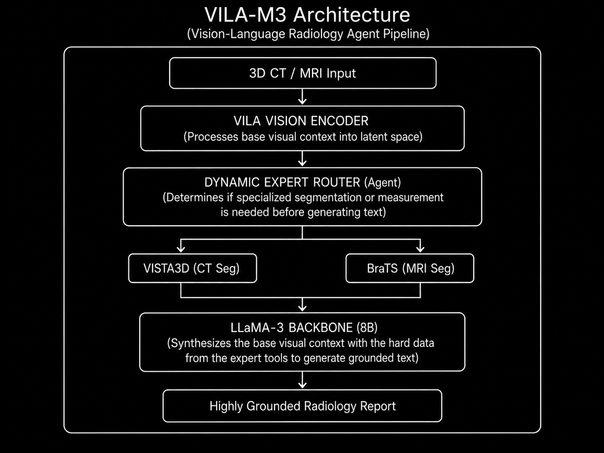

# Model Card: VILA-M3

> **Enhancing Vision-Language Models with Medical Expert Knowledge**

---

## Model Overview

| Property | Details |
|----------|---------|
| **Model Name** | VILA-M3 |
| **Version** | v1.0 |
| **Model Type** | 3D Vision-Language Model / Radiology Agent |
| **Architecture** | VILA framework + LLaMA backbone + Dynamic Expert Routing |
| **Parameters** | **8B** (Also available in 3B, 13B, and 40B variants) |
| **Input Modality** | 3D CT/MRI Volumes and 2D Medical Images |
| **Developer** | NVIDIA Research, NIH, SingHealth |
| **Publication** | CVPR / arXiv (2024) |
| **License** | Open Source (Academic/Research Use) |
| **Repository** | [GitHub](https://github.com/nvme-research/VILA-M3) (Integrated with MONAI) |

---

## Intended Use

### Primary Use Cases
- **Complex Radiology Report Generation** from 3D volumetric scans.
- **Medical Visual Question Answering (VQA)** requiring precise anatomical grounding.
- **Dynamic Task Routing:** Acting as an agent to trigger specific expert models (like VISTA3D for segmentation or MONAI BraTS for tumor analysis) to inform its text generation.

### Target Users
- Researchers utilizing the MONAI (Medical Open Network for AI) ecosystem.
- Healthcare institutions exploring autonomous "Radiology Agents."
- Developers needing a robust, scalable medical VLM.

### Out-of-Scope Uses
- Real-time diagnostic decision-making without a clinician.
- Sole deployment without access to its requisite expert tools.

---

## Architecture

### High-Level Design



### Architectural Refinements over Standard VLMs

| Component | Standard Medical VLM | VILA-M3 |
|-----------|----------------------|---------|
| **Knowledge Base** | Implicitly memorized in LLM weights | Explicitly retrieved via external Expert Models |
| **Generation Style** | Direct end-to-end generation | Agentic, multi-step synthesis |
| **Integration** | Standalone | Deeply integrated into the MONAI ecosystem |

---

## Training Details

### Pre-training & Expert Integration

| Property | Details |
|----------|---------|
| **Base Model** | Pre-trained VILA (Vision-Language) foundation |
| **LLM Backbone** | LLaMA-2 / LLaMA-3 (Depending on variant size) |
| **Expert Tools** | VISTA3D, Auto3DSeg, and other MONAI Zoo models |
| **Hardware** | Multi-node NVIDIA DGX clusters |

### Training Protocol
1. **Base Multimodal Pre-training:** Standard image-text alignment on large-scale datasets.
2. **Tool-Use Fine-Tuning:** The model is fine-tuned to act as an agent, learning when to output "trigger tokens" that call external medical segmentation/measurement tools.
3. **Synthesis Tuning:** The model learns to ingest the numerical/spatial data returned by the tools to write a highly precise textual report.

---

## Benchmark Performance

### Expert-Grounded Evaluation

VILA-M3 excels in benchmarks where high-precision counting, measuring, and segmentation grounding are required—areas where standard VLMs fail due to representational bottlenecks.

| Metric Domain | Performance vs. Baselines |
|---------------|---------------------------|
| **Grounded Report Generation** | Significantly outperforms models of equivalent size by eliminating hallucinated measurements (relying on actual segmentation outputs). |
| **Medical VQA** | State-of-the-art on complex spatial questions (e.g., "What is the exact volume of the tumor in the left hemisphere?"). |
| **Compute Efficiency** | Highly scalable; the 8B variant performs competitively with 70B generalist models when equipped with its expert tools. |

---

## Key Innovations

1. **Radiology Agent Paradigm:** Moves away from simple prompt-response behavior toward a multi-step, tool-using agent architecture.
2. **Expert Tool Integration:** Seamlessly interfaces with established, highly accurate specialized models (like VISTA3D) rather than trying to relearn their capabilities from scratch.
3. **Reduced Hallucinations:** By offloading specific tasks (like counting lesions) to deterministic expert tools, it drastically reduces the LLM's tendency to hallucinate clinical facts.
4. **Multiple Parameter Scales:** Offers extreme flexibility for researchers by providing high-quality weights across 3B, 8B, 13B, and 40B scales.

---

## Limitations

- **System Complexity:** Deploying VILA-M3 requires also deploying its entire suite of expert tools, resulting in a heavier, more complex MLOps footprint.
- **Latency:** The multi-step agentic process (evaluating image -> calling tool -> waiting for segmentation -> synthesizing text) increases inference time compared to single-pass VLMs.
- **Tool Dependency:** The VLM's accuracy is heavily bottlenecked by the accuracy of the expert tool it calls.

---

## Ethical Considerations

- **Clinical Validation Required:** Must undergo rigorous site-specific validation before clinical deployment.
- **Cascading Errors:** If an expert tool makes a segmentation error, the LLM will confidently synthesize that error into the report.
- **Regulatory Compliance:** No FDA/CE clearance — strictly for research use.

---

## Citation

```bibtex
@inproceedings{vilam32024,
  title={VILA-M3: Enhancing Vision-Language Models with Medical Expert Knowledge},
  author={Nath, Vishwesh and others},
  booktitle={Proceedings of the IEEE/CVF Conference on Computer Vision and Pattern Recognition (CVPR)},
  year={2024}
}
```

---

*Model card prepared for internal research reference — Brain Foundation Models Lab*
